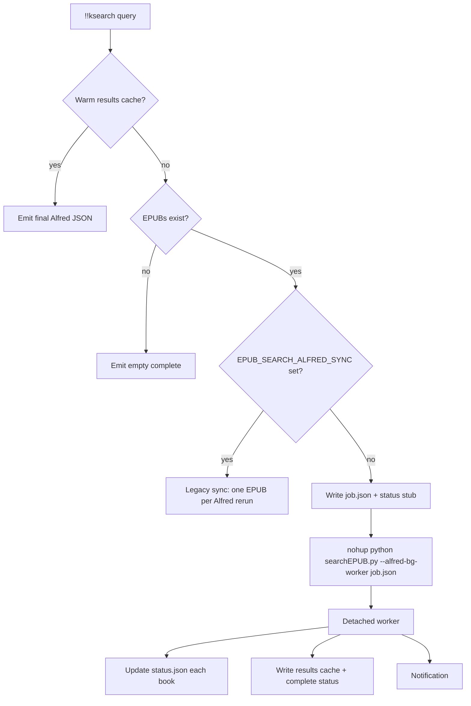

# Alfred library EPUB search: background worker pipeline

This document describes how **library-wide** full-text search works when you use the workflow’s **`!!ksearch`** keyword (Script Filter running `searchEPUB.py` with `--alfred` and **no** `--book`). It complements the older “incremental” mode and the dual Apple Books EPUB roots (`BKAgentService` + iCloud Books documents).

## Goals

- **Long scans** (hundreds of EPUBs) should not depend on Alfred staying open or re-invoking the Script Filter once per book.
- **Progress** while the scan runs should still be visible when Alfred is open (`rerun` JSON + status file).
- **Completion** should be visible even if Alfred was dismissed: a **macOS notification** fires when the worker finishes.
- **Drill-down** into per-book matches should keep using the **same on-disk JSON cache** as before.

## Components

| Piece | Role |
|--------|------|
| **Alfred Script Filter** (`!!ksearch`) | Runs `searchEPUB.py "<query>" --alfred` (with optional `--book=…` for single-book search). For **folder / library** mode, `--book` is empty. |
| **Foreground logic** | `search_with_alfred_progress()` in `searchEPUB.py`: warm cache, empty library, then either **background** or **sync** path. |
| **Background worker** | Separate OS process: `python3 -u searchEPUB.py --alfred-bg-worker <job.json>`, started under **`nohup`** via `bash -c` so it is not tied to Alfred’s UI lifetime. |
| **Job file** | JSON describing one scan (query, folder arg, context, proximity, whether to write modified EPUBs). |
| **Status file** | JSON updated by the worker so Alfred can **poll** progress (`processed` / `total`, current title, match count). |
| **Results cache** | Same file as pre-background behavior: `{workflow_cache}/epub_search/search_<hash>.json` — used for the book overview and **drill-down**. |

Single-book search (`--book=…`) is **unchanged**: it still runs entirely inside one Script Filter invocation (no background worker).

## High-level pipeline



Each later **Script Filter** run (Alfred’s `rerun` timer or you typing the same query again) **polls** `status.json` until `phase` is `complete`, then the next run typically hits the **warm cache** and returns the full book overview without restarting the worker.

## Foreground (Alfred) path

1. **`resolve_epub_scan_roots` / `epub_scan_cache_token`**  
   If `--folder` is the default Apple BKAgent path **or** the iCloud Books documents path, **both** existing directories are scanned (deduped by `realpath`). The **cache key** includes the combined token so drill-down stays consistent.

2. **Warm cache**  
   If `search_<hash>.json` exists and is younger than `SEARCH_CACHE_DAYS` (default 11), the Script Filter returns the **final** book overview immediately (no worker, no `rerun`).

3. **Background mode (default)**  
   - **Job id**: short hash of `folder_cache_token`, search text, context words, and proximity (so one job file per distinct scan).
   - **Spawn lock**: `fcntl` flock on `bg_jobs/.spawn_lock` so two simultaneous Alfred invocations rarely start two workers for the **same** job.
   - **Spawn**: writes `*.job.json`, writes initial `*.status.json` (`pid: 0` until the worker overwrites with its real PID), then runs the **`nohup`** shell command (see `searchEPUB.py`: `_spawn_nohup_alfred_bg_worker`).
   - **Poll response**: reads `*.status.json`, builds Alfred JSON via `export_alfred_books_overview` with `detached: true` and `accumulated_matches` from the worker. Top-level JSON includes **`rerun`** (0.5s) while `phase != complete`.

4. **Sync mode (`EPUB_SEARCH_ALFRED_SYNC=1`)**  
   Restores the previous design: **one EPUB per Script Filter run**, state in a temp JSON under `TMPDIR`, no `nohup`. Useful for debugging or if you do not want a detached process.

## Background worker path

Entry point (before `docopt` in `__main__`):

```text
python3 -u searchEPUB.py --alfred-bg-worker /path/to/<job_id>.job.json
```

The worker:

1. Loads **`job.json`** (`folder_arg`, `search_text`, `context_words`, `proximity_distance`, `create_modified_epubs`).
2. Recomputes EPUB list (same logic as foreground).
3. Sets **`status.json`** to `phase: running` with **`pid`** = worker PID.
4. For each EPUB: runs `search_single_epub`, appends to an in-memory results list, rewrites **`status.json`** with `processed`, `total`, `current_book`, `accumulated_matches`.
5. Writes the **results cache** (same schema as before: `search_text`, `folder_path` token, `scan_roots`, `results`).
6. Sets **`status.json`** to `phase: complete`.
7. Sends **`display notification`** via `osascript` (success or failure).

Errors set `phase: error` and notify with a short message.

## On-disk layout

Under the workflow cache directory (`alfred_workflow_cache` → `config.CACHE_FOLDER`):

```text
epub_search/
  search_<md5>.json          # Final results cache (drill-down reads this)
  bg_jobs/
    <job_id>.job.json        # Worker input (immutable for that run)
    <job_id>.status.json     # Worker progress / phase (polled by Alfred)
    <job_id>.log             # nohup stdout/stderr
    .spawn_lock              # Empty file; flocked during spawn only
```

`job_id` is a 16-character hex string derived from scan parameters.

## Alfred JSON and UX

- While **`phase == running`**, the overview row explains that the scan runs **in the background** and suggests reopening **`!!ksearch`** with the **same query** to refresh, or waiting for the **notification**.
- **`accumulated_matches`** lets the progress line show a growing match count even before the final grouped-by-book list exists in the cache.
- When **`phase == complete`** and the cache file is present, the next Script Filter run hits the **warm cache** branch and shows the full book overview.
- Warm-cache summary rows are marked with a cache emoji (`🗄️`) and include cache age in the subtitle (`cached 2d 4h ago`).

## Empty-query cache index and delete flow

When `!!ksearch` runs in Alfred mode with an empty query:

- `searchEPUB.py` returns a **cache index** (one row per `search_<id>.json`) instead of launching a blank full-text scan.
- Each row shows query text, hit/book counts, and cache age.
- `autocomplete` is set to the original query so selecting a row (Tab) quickly reruns that cached search path.
- A modifier row payload is exposed for deletion:
  - **`cmd+alt+ctrl`** subtitle: delete cached search
  - modifier `arg`: cache ID (`<id>` from `search_<id>.json`)
  - modifier variables: `action=delete_cached_search`, `cache_id=<id>`

Deletion helper:

- Script: `source/deleteSearchCache.py`
- Input: cache ID
- Behavior:
  - Deletes `epub_search/search_<id>.json`
  - Best-effort cleans matching `bg_jobs` artifacts (`*.job.json`, `*.status.json`, `*.log`) containing that ID
- Output strings:
  - Success: `Deleted cache for '<query>' (N files)`
  - Not found: `Cache <id> not found`
  - Invalid id: `Invalid cache ID`

## Environment variables

| Variable | Effect |
|----------|--------|
| **`EPUB_SEARCH_ALFRED_SYNC`** | If set to `1` / `true` / `yes` / `on`, use **legacy incremental** search (no background worker). |
| **`SEARCH_CACHE_DAYS`** | TTL for skipping a new scan when the results cache is fresh (existing behavior). |
| **`SEARCH_CONTEXT_WORDS`**, **`SEARCH_PROXIMITY_WORDS`** | Passed through from Alfred / workflow config as today. |

## Relation to Heuriske

The **Heuriske** workflow’s `CLAUDE.md` describes running long searches so Alfred can close; the checked-in **`heuriske.py`** still runs **synchronously** and uses **`progress()`** + log file + **notification** after completion. The alfred-kindle implementation here adds an explicit **`nohup`** subprocess and a **status file** so Alfred can **poll** coarse progress while a **detached** Python process owns the full-library loop.

## Troubleshooting

| Symptom | What to check |
|---------|----------------|
| No notification | macOS Notification permissions for **Script Editor** / **osascript** / **Terminal** (depending on OS version); also verify the worker is running (see log). |
| Stuck on “Starting background worker” | Open **`bg_jobs/<job_id>.log`**. If `pid` stayed `0` for more than ~2 minutes, delete **`status.json`** for that job and run the same query again. |
| Wrong or empty results | Confirm dual-root resolution: EPUBs under BKAgent **and** iCloud Books documents; DRM-heavy Apple titles may still produce no matches. |
| Prefer old behavior | Set **`EPUB_SEARCH_ALFRED_SYNC=1`** in the workflow’s environment variables for the `!!ksearch` Script Filter (or globally in the workflow if you centralize env). |

## Code map

| Symbol | File |
|--------|------|
| `search_with_alfred_progress` | Chooses cache / empty / sync / background. |
| `_search_with_alfred_progress_background` | Spawn + poll + `emit_from_cache` / `emit_poll`. |
| `_search_with_alfred_progress_sync` | Legacy one-book-per-invocation. |
| `run_alfred_bg_worker` | Worker main body. |
| `_spawn_nohup_alfred_bg_worker` | `bash -c` + `nohup` command line. |
| `export_alfred_books_overview` | `rerun`, `detached` subtitle, `accumulated_matches`. |
| `export_alfred_cached_searches_index` | Empty-query cache index rows + delete modifier payload. |
| `deleteSearchCache.py` | Delete cached search artifacts by cache ID. |
